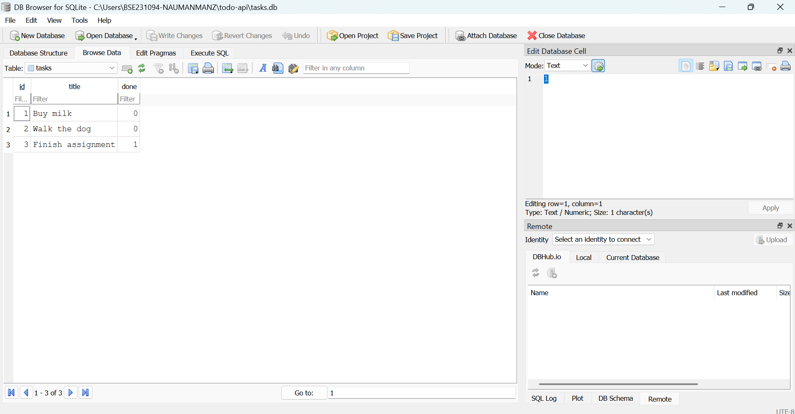

# Task API

A simple CRUD (Create, Read, Update, Delete) REST API for managing a to-do list, built with Node.js and Express. Data is stored in a **SQLite** database, so it survives server restarts.

## Install & run

```bash
npm install
node index.js
```

Server runs on `http://localhost:3000`. Interactive docs available at `http://localhost:3000/docs`.

That single command is all a fresh clone needs. On first start the app creates `tasks.db`, creates the `tasks` table, and seeds three example tasks — no manual setup, no migration step.

## Endpoints

| Method | Endpoint      | Description         |
|--------|---------------|---------------------|
| GET    | `/`           | API info            |
| GET    | `/health`     | Health check        |
| GET    | `/tasks`      | List all tasks      |
| GET    | `/tasks/:id`  | Get a single task   |
| POST   | `/tasks`      | Create a new task   |
| PUT    | `/tasks/:id`  | Update a task       |
| DELETE | `/tasks/:id`  | Delete a task       |

## Example

```bash
curl -i http://localhost:3000/tasks/1
```

```
HTTP/1.1 200 OK
Content-Type: application/json; charset=utf-8

{"id":1,"title":"Buy milk","done":false}
```

## Why SQLite

- **Zero setup** — no database server to install, configure or keep running. The library is one `npm install`.
- **A single file** — the whole database is `tasks.db`, easy to inspect, copy, or delete and rebuild.
- **It persists** — data written by the API is still there after the process stops and starts, which an in-memory array can never give you.

`better-sqlite3` was chosen over other Node drivers because its queries are synchronous, so the storage code reads top to bottom with no `await` or callbacks.

## Where the database lives

`tasks.db` sits in the project root and is **created automatically** the first time the app starts. It's listed in `.gitignore` and deliberately not committed — the database is generated data, not source code, so every clone builds its own fresh copy with the three seeded tasks.

Deleting `tasks.db` and restarting is a safe way to reset to a clean state.

## Schema

| Column  | Type      | Notes                                      |
|---------|-----------|--------------------------------------------|
| `id`    | INTEGER   | Primary key — SQLite assigns it            |
| `title` | TEXT      | Required, non-empty                        |
| `done`  | INTEGER   | `0` / `1` — SQLite has no boolean type     |

The API converts `done` back to `true` / `false` on the way out, so the JSON shape is unchanged from the in-memory version.

The three seed rows are inserted inside a transaction, which makes the seed all-or-nothing: a failure partway through rolls the whole thing back rather than leaving a half-populated table.

## Safety — parameterized queries

Every query uses `?` placeholders and passes values separately:

```js
db.prepare('SELECT * FROM tasks WHERE id = ?').get(id);
```

User input is never glued into the SQL string, so a crafted title or id is stored as data instead of being executed as part of the query.

## Exploring the database directly

The same `tasks.db` can be opened in [DB Browser for SQLite](https://sqlitebrowser.org/) while the server is running. There's no syncing between the two — they read the exact same file, so a change made by hand appears through the API immediately.

One query run in DB Browser's **Execute SQL** tab:

```sql
SELECT * FROM tasks WHERE done = 1;
```

It returned only the completed tasks. The filtering happened inside the database rather than in JavaScript — the app never received the rows it didn't want.



## Proving the API didn't change

The same `curl` commands written for the in-memory version still pass unchanged against the SQLite version — same endpoints, same request and response shapes, same status codes (`200`, `201`, `204`, `400`, `404`).

That's the real proof that storage is an implementation detail: clients were never told where the data lives, only what the API promises to return. The promise stayed the same while everything behind it moved from memory to disk.