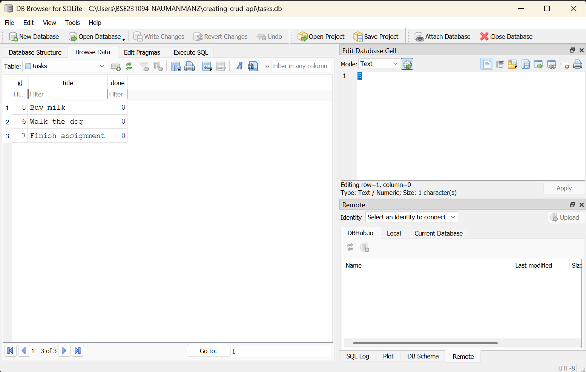

# Creating CRUD API — Week 3: SQLite Persistence

A FastAPI task-management API, now backed by a real SQLite database instead of in-memory storage.

## Why SQLite

SQLite was chosen because it's a single file (`tasks.db`), needs zero setup or separate server,
and survives restarts — unlike the in-memory version from Week 2 where data disappeared every
time the server stopped.

## Where the database lives

`tasks.db` is created automatically the first time the app runs. It's git-ignored, so every
fresh clone starts with a brand-new, empty-then-seeded database — nobody needs to set anything
up manually.

## Run it

```bash
python -m venv venv
venv\Scripts\activate          # Windows
pip install -r requirements.txt
uvicorn main:app --reload
```

The API runs at `http://127.0.0.1:8000`. On first run, `tasks.db` is created automatically
with 3 seeded example tasks.

## Endpoints

- `GET /tasks` — list all tasks
- `GET /tasks/{id}` — get one task
- `POST /tasks` — create a task
- `PUT /tasks/{id}` — update a task
- `DELETE /tasks/{id}` — delete a task

## Database screenshot



## Example SQL query (Stage 4)

```sql
DELETE FROM tasks WHERE done = 1;
```

Ran this by hand in DB Browser after marking all tasks done — it deleted all 3 rows, and
`GET /tasks` immediately returned an empty list with no server restart, confirming the API
and DB Browser read the exact same file live.