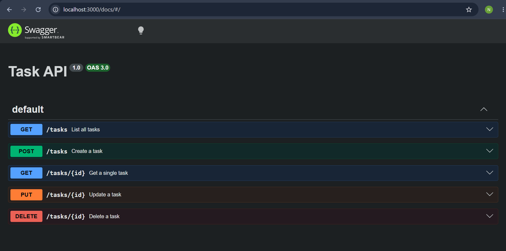

# Task API

A simple CRUD (Create, Read, Update, Delete) REST API for managing a to-do list, built with Node.js and Express. Data is stored in memory and resets when the server restarts.

## Install & run

```bash
npm install
node index.js
```

Server runs on `http://localhost:3000`. Interactive docs available at `http://localhost:3000/docs`.

## Endpoints

| Method | Endpoint      | Description         |
|--------|---------------|----------------------|
| GET    | `/`           | API info             |
| GET    | `/health`     | Health check         |
| GET    | `/tasks`      | List all tasks       |
| GET    | `/tasks/:id`  | Get a single task    |
| POST   | `/tasks`      | Create a new task    |
| PUT    | `/tasks/:id`  | Update a task        |
| DELETE | `/tasks/:id`  | Delete a task        |

## Example

```bash
curl -i http://localhost:3000/tasks/1
```

```
HTTP/1.1 200 OK
Content-Type: application/json; charset=utf-8

{"id":1,"title":"Buy milk","done":false}
```

## Swagger UI


